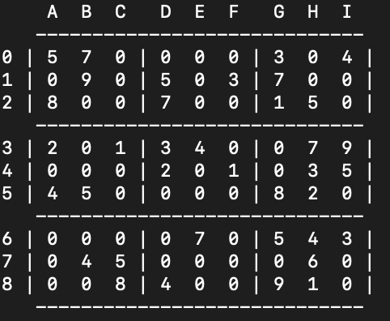

# P2P - Sudoku
#### University project for Architecture Distributed for Cloud

## Project Description
Design and develop a Sudoku challenge game on a P2P network. Each user can place a number of the sudoku game; if it is not already placed takes 1 point, if it is already placed and it is rights take 0 points, in other case receive -1 point. The games are based on a 9 x 9 matrix. All users that play to a game are automatically informed when a user increment its score and when the game is finished. The system allows the users to generate (automatically) a new Sudoku challenge identified by a name, join in a challenge using a nickname, get the integer matrix describing the Sudoku challenge, and place a solution number.
<p align="left"></p>


Dillinger is a cloud-enabled, mobile-ready, offline-storage compatible,
AngularJS-powered HTML5 Markdown editor.

- Type some Markdown on the left
- See HTML in the right
- ✨Magic ✨

## Features

- Import a HTML file and watch it magically convert to Markdown
- Drag and drop images (requires your Dropbox account be linked)
- Import and save files from GitHub, Dropbox, Google Drive and One Drive
- Drag and drop markdown and HTML files into Dillinger
- Export documents as Markdown, HTML and PDF

Markdown is a lightweight markup language based on the formatting conventions
that people naturally use in email.
As [John Gruber] writes on the [Markdown site][df1]

> The overriding design goal for Markdown's
> formatting syntax is to make it as readable
> as possible. The idea is that a
> Markdown-formatted document should be
> publishable as-is, as plain text, without
> looking like it's been marked up with tags
> or formatting instructions.

This text you see here is *actually- written in Markdown! To get a feel
for Markdown's syntax, type some text into the left window and
watch the results in the right.


## Tech 

This project uses a number of open source projects to work properly:

- [Java] - programming language
- [TomP2P] - Library for create the DHT
- [Maven] - Project management used for develop
- [JUnit-5] - Framework used testing 
- [Docker] - Software used for manage containers
- [args4j] - Java library for parse command line options/arguments
- [Text-IO] - library for creating Java console applications


## Installation

Dillinger requires [Node.js](https://nodejs.org/) v10+ to run.

Install the dependencies and devDependencies and start the server.

```sh
cd dillinger
npm i
node app
```

For production environments...

```sh
npm install --production
NODE_ENV=production node app
```

## Plugins

Dillinger is currently extended with the following plugins.
Instructions on how to use them in your own application are linked below.

| Plugin | README |
| ------ | ------ |
| Dropbox | [plugins/dropbox/README.md][PlDb] |
| GitHub | [plugins/github/README.md][PlGh] |
| Google Drive | [plugins/googledrive/README.md][PlGd] |
| OneDrive | [plugins/onedrive/README.md][PlOd] |
| Medium | [plugins/medium/README.md][PlMe] |
| Google Analytics | [plugins/googleanalytics/README.md][PlGa] |

## Development

Want to contribute? Great!

Dillinger uses Gulp + Webpack for fast developing.
Make a change in your file and instantaneously see your updates!

Open your favorite Terminal and run these commands.

First Tab:

```sh
node app
```

Second Tab:

```sh
gulp watch
```

(optional) Third:

```sh
karma test
```

#### Building for source

For production release:

```sh
gulp build --prod
```

Generating pre-built zip archives for distribution:

```sh
gulp build dist --prod
```

## Docker

Dillinger is very easy to install and deploy in a Docker container.

By default, the Docker will expose port 8080, so change this within the
Dockerfile if necessary. When ready, simply use the Dockerfile to
build the image.

```sh
cd dillinger
docker build -t <youruser>/dillinger:${package.json.version} .
```

This will create the dillinger image and pull in the necessary dependencies.
Be sure to swap out `${package.json.version}` with the actual
version of Dillinger.

Once done, run the Docker image and map the port to whatever you wish on
your host. In this example, we simply map port 8000 of the host to
port 8080 of the Docker (or whatever port was exposed in the Dockerfile):

```sh
docker run -d -p 8000:8080 --restart=always --cap-add=SYS_ADMIN --name=dillinger <youruser>/dillinger:${package.json.version}
```

> Note: `--capt-add=SYS-ADMIN` is required for PDF rendering.

Verify the deployment by navigating to your server address in
your preferred browser.

```sh
127.0.0.1:8000
```

## License

MIT

**Free Software, Hell Yeah!**

[//]: # (These are reference links used in the body of this note and get stripped out when the markdown processor does its job. There is no need to format nicely because it shouldn't be seen. Thanks SO - http://stackoverflow.com/questions/4823468/store-comments-in-markdown-syntax)

   [Java]: <https://docs.oracle.com/en/java/>
   [TomP2P]: <https://github.com/tomp2p/TomP2P>
   [Maven]: <https://github.com/apache/maven>
   [Junit-5]: <https://github.com/junit-team/junit5>
   [Docker]: <https://github.com/docker>
   [args4j]: <https://github.com/kohsuke/args4j>
   [Text-IO]: <https://github.com/beryx/text-io>
  

   [PlDb]: <https://github.com/joemccann/dillinger/tree/master/plugins/dropbox/README.md>
   [PlGh]: <https://github.com/joemccann/dillinger/tree/master/plugins/github/README.md>
   [PlGd]: <https://github.com/joemccann/dillinger/tree/master/plugins/googledrive/README.md>
   [PlOd]: <https://github.com/joemccann/dillinger/tree/master/plugins/onedrive/README.md>
   [PlMe]: <https://github.com/joemccann/dillinger/tree/master/plugins/medium/README.md>
   [PlGa]: <https://github.com/RahulHP/dillinger/blob/master/plugins/googleanalytics/README.md>
